# CNN using Pytorch for Cancer detection


```python
# necessary packages
import os
import torch
from torch.utils.data import random_split
from torch.utils.data import DataLoader, Dataset, Subset, SubsetRandomSampler
from torchvision import datasets, transforms, models 
from torchvision.datasets import ImageFolder
from torchvision.transforms import ToTensor
from torchvision.utils import make_grid
import torch.nn as nn
import torch.nn.functional as F
import torchvision
import torchvision.transforms as transforms
import numpy as np
import pandas as pd
import matplotlib.pyplot as plt
from sklearn.model_selection import train_test_split
from sklearn.metrics import classification_report, confusion_matrix, ConfusionMatrixDisplay
from PIL import Image
import random

torch.set_default_dtype(torch.float32)
```

Lungenkrebs Datensatz in das System Laden


```python
lung_dataset = '../lung_colon_image_set/lung_image_sets'
colon_dataset = '../lung_colon_image_set/colon_image_sets'
if not os.path.exists(lung_dataset):
    raise FileNotFoundError(f"Dataset path {lung_dataset} does not exist!")
if not os.path.exists(colon_dataset):
    raise FileNotFoundError(f"Dataset path {colon_dataset} does not exist!")

lung_classes=sorted(os.listdir(lung_dataset))
colon_classes=sorted(os.listdir(colon_dataset))

print(f"Classes found: {lung_classes} and {colon_classes}")

all_classes = sorted(set(lung_classes + colon_classes))
print(f"Combined classes: {all_classes}")

```

    Classes found: ['lung_aca', 'lung_n', 'lung_scc'] and ['colon_aca', 'colon_n']
    Combined classes: ['colon_aca', 'colon_n', 'lung_aca', 'lung_n', 'lung_scc']


## Bilder in Train, Test und Validierungssplits aufteilen

Teilt die Bilder in drei Kategorien ein
- 80% sind Trainingsdaten
- 10% sind Testdaten
- 10% sind Validierungsdaten


```python
def prepare_splits(datadirs, split_ratios=(0.8, 0.1, 0.1)):
    all_data = {}
    for datadir in datadirs:
        for cls in sorted(os.listdir(datadir)):
            class_dir = os.path.join(datadir, cls)
            if os.path.isdir(class_dir):
                all_data.setdefault(cls, []).extend(
                    os.path.join(class_dir,fname) for fname in os.listdir(class_dir)
                )
    
    splits = {'train': [], 'val': [], 'test': []}
    
    for cls, files in all_data.items():
        train_files, temp_files = train_test_split(files, test_size=(1 - split_ratios[0]), random_state=42)
        
        val_files, test_files = train_test_split(temp_files, test_size=split_ratios[2]/(split_ratios[1] + split_ratios[2]), random_state=42)
        
        splits['train'].extend(train_files)
        splits['val'].extend(val_files)
        splits['test'].extend(test_files)
        
    return splits

dataset_dirs = [lung_dataset, colon_dataset]
data_splits = prepare_splits(dataset_dirs)

print(f"Training samples: {len(data_splits['train'])}")
print(f"Validation samples: {len(data_splits['val'])}")
print(f"Testing samples: {len(data_splits['test'])}")
```

    Training samples: 20000
    Validation samples: 2500
    Testing samples: 2500


```python
class CombinedCancerDataset(Dataset):
    def __init__(self, file_paths, all_classes, transform=None):
        self.file_paths = file_paths
        self.all_classes = all_classes
        self.labels = [all_classes.index(os.path.basename(os.path.dirname(fp))) for fp in file_paths]
        self.transform = transform
        
    def __len__(self):
        return len(self.file_paths)
    
    def __getitem__(self, idx):
        img_path = self.file_paths[idx]
        label = self.labels[idx]
        image = Image.open(img_path).convert("RGB")
        
        if self.transform:
            image = self.transform(image)
        return image, label
```


```python
transform = transforms.Compose([
    transforms.Resize((256, 256)),
    transforms.RandomRotation(random.randint(-20, 20)),
    transforms.ToTensor(),
    transforms.Normalize(mean=[0.485, 0.456, 0.406], std=[0.229, 0.224, 0.225])
])    

# Datasets
train_dataset = CombinedCancerDataset(data_splits['train'], all_classes, transform=transform)
val_dataset = CombinedCancerDataset(data_splits['val'], all_classes, transform=transform)
test_dataset = CombinedCancerDataset(data_splits['test'], all_classes, transform=transform)

# DataLoaders
train_loader = DataLoader(train_dataset, batch_size=16, shuffle=True)
val_loader = DataLoader(val_dataset, batch_size=16, shuffle=False)
test_loader = DataLoader(test_dataset, batch_size=16, shuffle=False)


```


```python

```

##### CNN Klasse mit 6 convolutional Layer, 1 Pooling Layer, 3 batch normalizer und 2 Fully connected layers


```python
class CNN_Model(nn.Module):
    def __init__(self, num_classes=5):
        super(CNN_Model, self).__init__()
        self.conv1 = nn.Conv2d(3, 32, 3, padding=1)
        self.pool = nn.MaxPool2d(2, 2)
        # self.pool = nn.MeanPool2d(2, 2)
        # self.pool = nn.RandomPool2d(2, 2)
        self.conv2 = nn.Conv2d(32, 32, 3, padding=1)
        self.bn1 = nn.BatchNorm2d(32)
        self.conv3 = nn.Conv2d(32, 64, 3, padding=1)
        self.conv4 = nn.Conv2d(64, 64, 3, padding=1)
        self.bn2 = nn.BatchNorm2d(64)
        self.conv5 = nn.Conv2d(64, 128, 3, padding=1)
        self.conv6 = nn.Conv2d(128, 128, 3, padding=1)
        self.bn3 = nn.BatchNorm2d(128)
        
        self.fc1 = nn.Linear(128 * 4 * 4, 256)
        self.fc2 = nn.Linear(256, num_classes)
        
    def forward(self, x):
        x = F.relu(self.conv1(x))
        x = self.pool(x)
        x = F.relu(self.conv2(x))
        x = self.pool(x)
        x = self.bn1(x)
        x = F.relu(self.conv3(x))
        x = self.pool(x)
        x = F.relu(self.conv4(x))
        x = self.pool(x)
        x = self.bn2(x)
        x = F.relu(self.conv5(x))
        x = self.pool(x)
        x = F.relu(self.conv6(x))
        x = self.pool(x)
        x = self.bn3(x)
        
        #print(x.size())
        #print(f"Shape after conv layers: {x.shape}")
        
        x = x.view(x.size(0), -1)
        x = F.relu(self.fc1(x))
        x = self.fc2(x)
        return x
        
```


```python
# grad cam with bounding box

```

## Training des Modells

Training des Modells auf einem Trainingsdatensatz und Validierung durch einen Validierungsdatensatz über eine bestimmte Anzahl von Epochen. Verwendung von Adam-Optimierer und die Kreuzentropie-Verlustfunktion. Die Funktion verfolgt und speichert die Trainingsverluste, Validierungsverluste und Validierungsgenauigkeit für jede Epoche.

#### Ablauf
- Initialisiert den Adam-Optimierer und die Kreuzentropie-Verlustfunktion
- Verschiebt Modell auf das angegebene Gerät (CPU oder GPU)
- Initialisiert Listen zur Speicherung der Verluste und Genauigkeit
- **Trainingsschritte pro Epoche**

    - Daten auf das Gerät verschieben
    - Gradienten zurücksetzen
    - Vorwärtsdurchlauf, Parameter aktualieren
    - Verlust akkumulieren
    - Durchschnittliche Trainingsverluste berechnen

- **Validierung pro Epoche**

    - Modell in Evaluierungsmodus setzen, verlust und Zähler initialisieren
    - Für jede Charge:
        - Daten auf Gerät schieben
        - Vorwärtsdurchlauf, Verlust berechnen
        - Verlust akkumulieren
        - Vorhersagen analysieren, Genauigkeit berechnen
    - Durchschnittlichen Validierungsverlust und -genauigkeit berechnen und ausgeben
    
- Gibt die Listen der Trainingsverluste, Validierungsverluste und Validierungsgenauigkeiten zurück


```python
def train_model(model, train_loader, val_loader, num_epochs=10, lr=0.001):
    optimizer = torch.optim.Adam(model.parameters(), lr=lr)
    criterion = nn.CrossEntropyLoss()
    model.to(device)
    
    train_losses = []
    val_losses = []
    val_accuracies = []
    
    for epoch in range(num_epochs):
        model.train()
        running_loss = 0.0
        for images, labels in train_loader:
            images, labels = images.to(device), labels.to(device)
            optimizer.zero_grad()
            outputs = model(images)
            loss = criterion(outputs, labels)
            loss.backward()
            optimizer.step()
            running_loss += loss.item()
            
        epoch_train_loss = running_loss / len(train_loader)
        train_losses.append(epoch_train_loss)
    
        print(f"Epoch {epoch+1}, Loss: {running_loss/len(train_loader)}")
    

        model.eval()
        val_loss = 0.0
        correct = 0
        total = 0
        with torch.no_grad():
            for images, labels in val_loader:
                images, labels = images.to(device), labels.to(device)
                outputs = model(images)
                loss = criterion(outputs, labels)
                val_loss += loss.item()
                _, predicted = torch.max(outputs, 1)
                total += labels.size(0)
                correct += (predicted == labels).sum().item()
                
        epoch_val_loss = val_loss / len(val_loader)
        val_accuracy = 100 * correct / total
        val_losses.append (epoch_val_loss)
        val_accuracies.append(val_accuracy)
                
        val_accuracy = 100 * correct / total
        print(f"Validation Loss: {val_loss/len(val_loader)}, Validation Accuracy: {val_accuracy}")
    
    return train_losses, val_losses, val_accuracies
```

### GPU für Training verwenden

- Anstatt von Cuda muss man bei Mac Mps verwenden also:

```python 
device = torch.device('mps' if torch.mps.is_available() else 'cpu')
```

```python 
device = torch.device('cuda' if torch.cuda.is_available() else 'cpu')
```


```python
device = torch.device('mps' if torch.mps.is_available() else 'cpu')
print(f"MPS available: {torch.backends.mps.is_available()}")
print(f"Using device: {device}")

# device = torch.device('cuda' if torch.cuda.is_available() else 'cpu')
# print(f"Cuda availabel: {torch.cuda.is_available()}")
# print(f"Using device: {device}")

if __name__ == "__main__":
    model = CNN_Model(num_classes=len(all_classes)).to(device)
    train_losses, val_losses, val_accuracies = train_model(model, train_loader, val_loader)

    print("Training abgeschlossen.")
```

    MPS available: True
    Using device: mps
    Epoch 1, Loss: 0.5195937506049871
    Validation Loss: 0.2298481313919183, Validation Accuracy: 91.8
    Epoch 2, Loss: 0.25860302503965793
    Validation Loss: 2.1081911671471683, Validation Accuracy: 91.68
    Epoch 3, Loss: 0.18599328870140017
    Validation Loss: 0.17299756196243718, Validation Accuracy: 94.64
    Epoch 4, Loss: 0.14311425176290796
    Validation Loss: 0.8986797228044753, Validation Accuracy: 96.4
    Epoch 5, Loss: 0.1331494641881436
    Validation Loss: 0.11547417952037121, Validation Accuracy: 95.76
    Training abgeschlossen.


```python
def visualize_predictions(model, test_loader, all_classes):
    model.eval()
    images, labels = next(iter(test_loader))
    images, labels = images.to(device), labels.to(device)
    
    with torch.no_grad():
        outputs = model(images)
        _, predicted = torch.max(outputs, 1)

    images = images.cpu()
    fig = plt.figure(figsize=(15, 10))
    for idx in range(8): 
        ax = fig.add_subplot(2, 4, idx+1, xticks=[], yticks=[])
        img = images[idx].permute(1, 2, 0)  
        img = img * torch.tensor([0.229, 0.224, 0.225]) + torch.tensor([0.485, 0.456, 0.406])  
        img = img.numpy().clip(0, 1)
        ax.imshow(img)
        ax.set_title(f"True: {all_classes[labels[idx]]}\nPred: {all_classes[predicted[idx]]}")

    plt.show()


visualize_predictions(model, test_loader, all_classes)
```


    
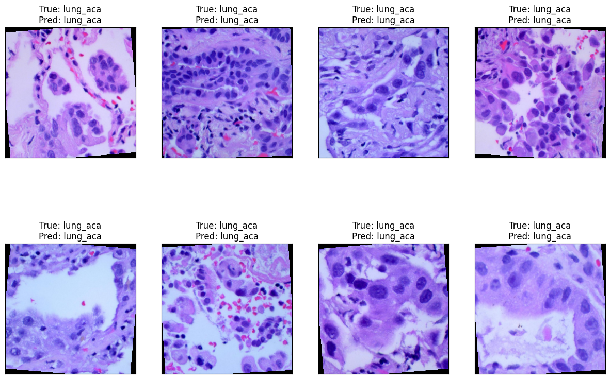
    


```python
def test_model(model, test_loader):
    model.eval()
    test_correct = 0
    test_total = 0
    all_labels = []
    all_preds = []

    with torch.no_grad():
        for images, labels in test_loader:
            images, labels = images.to(device), labels.to(device)
            outputs = model(images)
            _, predicted = torch.max(outputs, 1)
            test_total += labels.size(0)
            test_correct += (predicted == labels).sum().item()
            
            all_labels.extend(labels.cpu().numpy())
            all_preds.extend(predicted.cpu().numpy())
    
    test_accuracy = 100 * test_correct / test_total
    print(f"Test Accuracy: {test_accuracy:.2f}%")
    return all_labels, all_preds

all_labels, all_preds = test_model(model, test_loader)
```

    Test Accuracy: 96.08%


```python
cm = confusion_matrix(all_labels, all_preds, labels=range(len(all_classes)))
disp = ConfusionMatrixDisplay(confusion_matrix=cm, display_labels=all_classes)
disp.plot(cmap=plt.cm.Blues)
plt.title("Confusion Matrix")
plt.show()
```


    
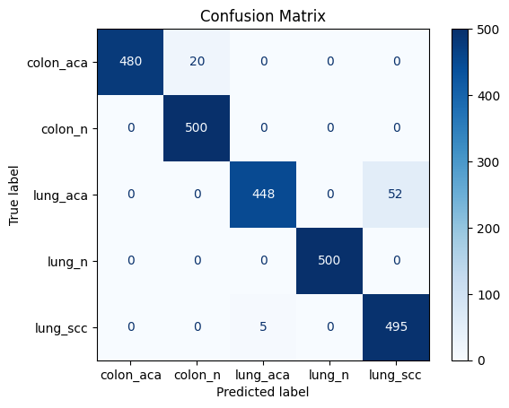
    


```python
#train_losses, val_losses, val_accuracies = train_model(model, train_loader, val_loader, num_epochs=10)
# plotting the loss and accuracy
def plot_loss_accuracy(train_losses, val_losses, val_accuracies):
    plt.figure(figsize=(12, 6))
    plt.subplot(1, 2, 1)
    plt.plot(train_losses, label='Training loss')
    plt.plot(val_losses, label='Validation loss')
    plt.title("Loss")
    plt.legend()

    plt.subplot(1, 2, 2)
    plt.plot(val_accuracies, label='Validation accuracy')
    plt.title("Accuracy")
    plt.legend()

    plt.show()
    
plot_loss_accuracy(train_losses, val_losses, val_accuracies)
```


    
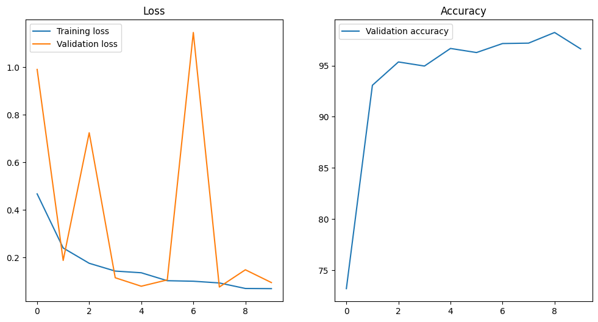
    


### Saving the model to a file


```python
# savving the model
save_path = './trainierte-modelle/cancer_cnn_model_2.pth'
torch.save(model.state_dict(), save_path)
print(f"Model saved to {save_path}")
```


```python
image_paths = [
    '../lung_colon_image_set/lung_image_sets/lung_aca/lungaca27.jpeg',
    '../lung_colon_image_set/lung_image_sets/lung_n/lungn378.jpeg',
    '../lung_colon_image_set/lung_image_sets/lung_scc/lungscc24.jpeg',
    '../lung_colon_image_set/colon_image_sets/colon_aca/colonca3874.jpeg',
    '../lung_colon_image_set/colon_image_sets/colon_n/colonn128.jpeg'
]
```

# Grad Cam

Eine simple Implementation für eine Grad Cam um mein Modell erklärbar zu machen


```python
from pytorch_grad_cam import GradCAM

# Funktion zur Anwendung von Grad-CAM auf ein einzelnes Bild
def apply_grad_cam(model, image_tensor, target_layer, class_idx=None):
    cam = GradCAM(model=model, target_layers=[target_layer])
    grayscale_cam = cam(input_tensor=image_tensor.unsqueeze(0), targets=None)
    grayscale_cam = grayscale_cam[0, :]
    return grayscale_cam

# Funktion zur Visualisierung von Grad-CAM auf einem Test-Datenloader
def visualize_grad_cam(model, test_loader):
    model.eval()
    for images, labels in test_loader:
        images, labels = images.to(device), labels.to(device)
        target_layer = model.conv6
        cam_image = apply_grad_cam(model, images[0], target_layer)
        plt.imshow(cam_image, cmap='jet')
        plt.title(f"Predicted Label: {labels[0].item()}")
        plt.show()
        break
        
visualize_grad_cam(model, test_loader)
    
```


    
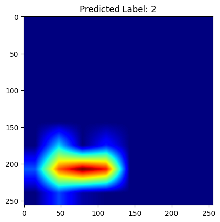
    


# Überlagerung mit dem Originalbild


```python
from pytorch_grad_cam.utils.image import show_cam_on_image
from pytorch_grad_cam import GradCAM

def visualize_gradcam(model, data_loader, target_layer):
    '''
    Visualize Grad-CAM for a batch of images from a data loader.
    Args:
        model (torch.nn.Module): The trained model to use for Grad-CAM.
        data_loader (torch.utils.data.DataLoader): DataLoader providing the images and labels.
        target_layer (torch.nn.Module): The target layer in the model for which Grad-CAM is computed.
    Returns:
        None: This function displays the original images and their corresponding Grad-CAM overlays.
    '''
    model.eval()
    images, labels = next(iter(data_loader))  
    images, labels = images.to(device), labels.to(device)
    
    cam = GradCAM(model=model, target_layers=[target_layer])
    
    for i in range(8):  
        input_tensor = images[i].unsqueeze(0) 
        grayscale_cam = cam(input_tensor=input_tensor)[0]
        image_rgb = images[i].permute(1, 2, 0).cpu().numpy()
        image_rgb = (image_rgb - image_rgb.min()) / (image_rgb.max() - image_rgb.min())
        
        cam_image = show_cam_on_image(image_rgb, grayscale_cam, use_rgb=True)
        
        plt.figure(figsize=(10, 5))
        plt.subplot(1, 2, 1)
        plt.imshow(image_rgb)
        plt.title(f"Original Image - Label: {labels[i].item()}")
        
        plt.subplot(1, 2, 2)
        plt.imshow(cam_image)
        plt.title(f"Grad-CAM Overlay")
        plt.show()

visualize_gradcam(model, test_loader, target_layer=model.conv4) 
```


    
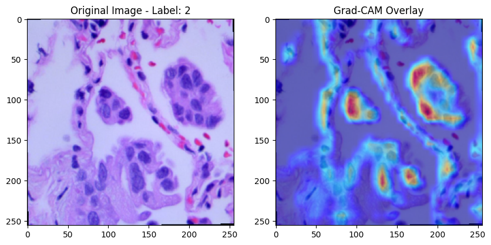
    


    
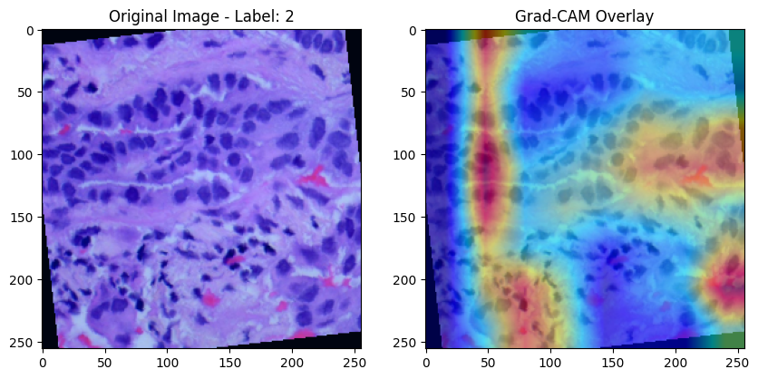
    


    
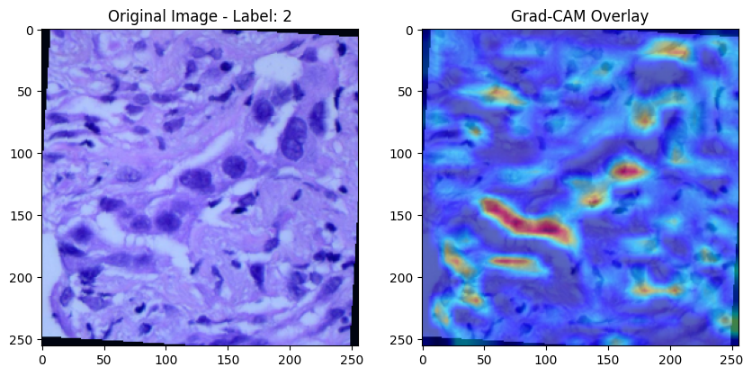
    


    
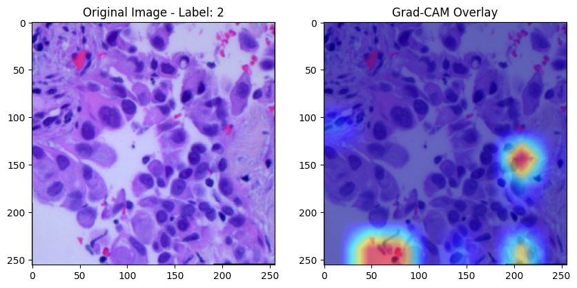
    


    
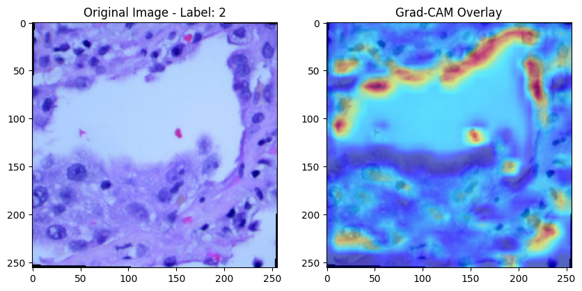
    


    
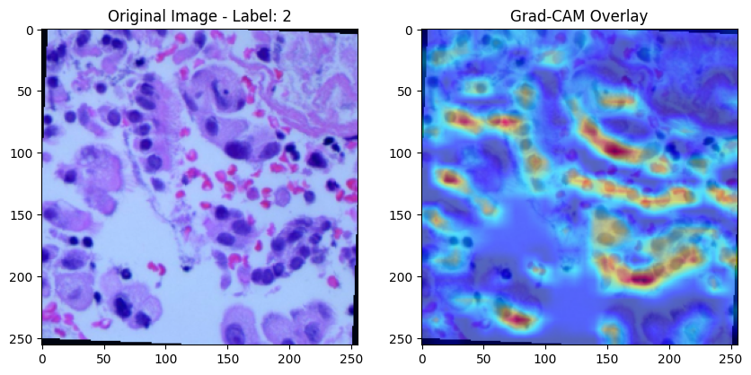
    


    
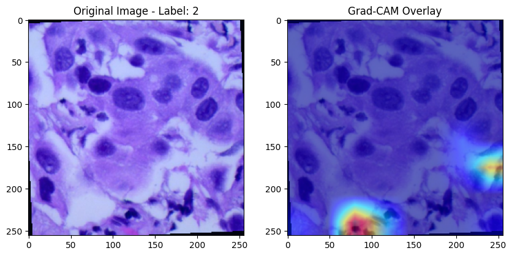
    


    
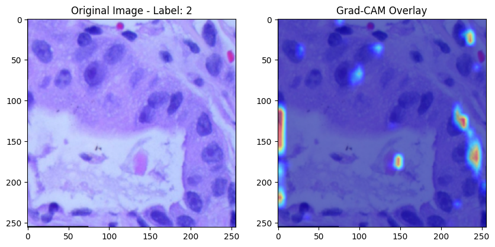
    


```python
import cv2
from captum.attr import LayerGradCam

def visualize_gradcam_on_images_captum(model, image_paths, target_layer, device='cpu'):
    """
    Apply Grad-CAM using Captum on specific images given their file paths.

    Args:
        model (torch.nn.Module): The trained model.
        image_paths (list): List of paths to images.
        target_layer (torch.nn.Module): The target layer in the model.
        device (str): 'cpu' or 'cuda'.

    Returns:
        Displays the Grad-CAM visualizations.
    """

    # Image preprocessing - same as during training
    transform = transforms.Compose([
        transforms.Resize((256, 256)),  # Ensure consistent input size
        transforms.ToTensor(),
        transforms.Normalize(mean=[0.485, 0.456, 0.406], std=[0.229, 0.224, 0.225])
    ])

    model.to(device)
    model.eval()
    
    grad_cam = LayerGradCam(model, target_layer)

    for image_path in image_paths:
        image = Image.open(image_path).convert("RGB")
        input_tensor = transform(image).unsqueeze(0).to(device)

        output = model(input_tensor)
        pred_label = output.argmax(dim=1).item()  # Get the predicted class

        attributions = grad_cam.attribute(input_tensor, target=pred_label)
        attributions = attributions.squeeze().cpu().detach().numpy()

        # Normalize attributions to [0, 1] range
        attributions = np.maximum(attributions, 0)  
        attributions = attributions / (attributions.max() + 1e-8) 

        # Convert image to NumPy format for visualization
        image_rgb = np.array(image) / 255.0  
        image_resized = cv2.resize(image_rgb, (attributions.shape[1], attributions.shape[0]))

        # Ensure attributions are correctly formatted for OpenCV
        heatmap = np.uint8(255 * attributions)
        heatmap = cv2.applyColorMap(heatmap, cv2.COLORMAP_JET) 

        # Normalize and blend heatmap with original image
        heatmap = heatmap.astype(np.float32) / 255  
        cam_image = (heatmap * 0.5) + (image_resized * 0.5)

        # Display results
        plt.figure(figsize=(10, 5))
        plt.subplot(1, 2, 1)
        plt.imshow(image)
        plt.title("Original Image")
        plt.axis("off")

        plt.subplot(1, 2, 2)
        plt.imshow(cam_image)
        plt.title(f"Grad-CAM Overlay (Class: {pred_label})")
        plt.axis("off")

        plt.show()

target_layer = model.conv3  

visualize_gradcam_on_images_captum(model, image_paths, target_layer, device=device)

```


    
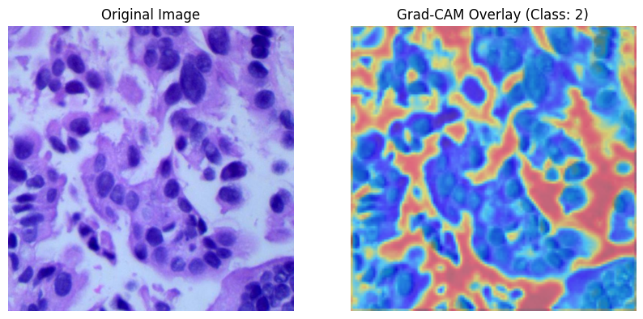
    


    
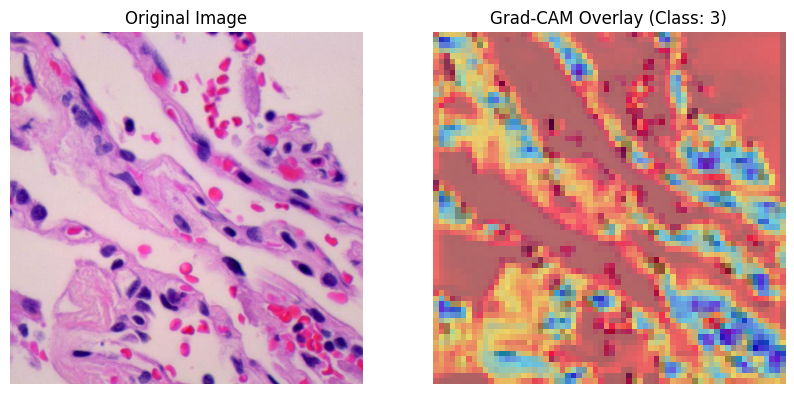
    


    
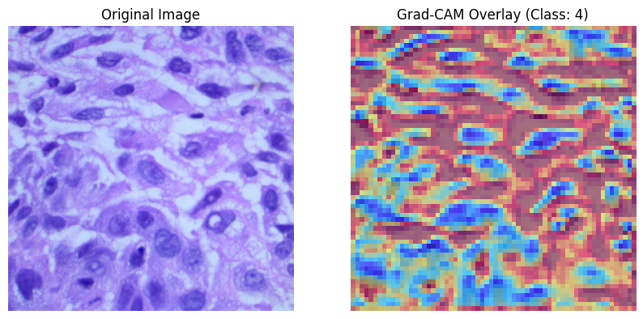
    


    
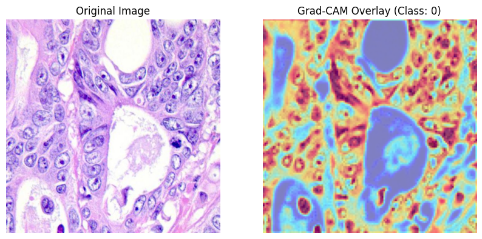
    


    
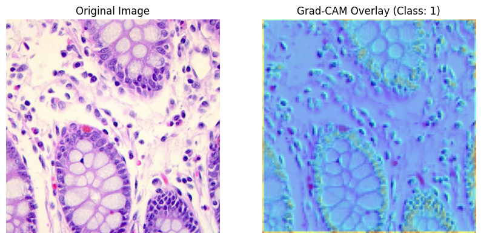
    


# XAI


```python
from lime import lime_image
from skimage.segmentation import mark_boundaries

def explain_with_lime(model, image_path, all_classes, device='cpu'):
    """
    Erklärt eine CNN-Vorhersage für ein einzelnes Bild mit LIME.
    
    Args:
        model: Das trainierte CNN-Modell.
        image_path: Pfad zum Bild, das erklärt werden soll.
        all_classes: Liste der Klassennamen.
        device: 'cpu' oder 'cuda' für Berechnungen auf GPU/CPU.

    Returns:
        Zeigt das Originalbild und die LIME-Erklärung.
    """
    
    transform = transforms.Compose([
        transforms.Resize((256, 256)),
        transforms.ToTensor(),
        transforms.Normalize(mean=[0.485, 0.456, 0.406], std=[0.229, 0.224, 0.225])
    ])
    
    image = Image.open(image_path).convert("RGB")
    image_tensor = transform(image).unsqueeze(0).to(device)
    
    model.eval()
    
    def batch_predict(images):
        images = torch.stack([transform(Image.fromarray(img)) for img in images], dim=0).to(device)
        model.eval()
        with torch.no_grad():
            outputs = model(images)
            probs = torch.nn.functional.softmax(outputs, dim=1).cpu().numpy()
        return probs

    explainer = lime_image.LimeImageExplainer()
    
    explanation = explainer.explain_instance(
        np.array(image),
        batch_predict,
        top_labels=1,  
        hide_color=0,
        num_samples=1000  
    )

    temp, mask = explanation.get_image_and_mask(
        explanation.top_labels[0],
        positive_only=True,
        num_features=5,  
        hide_rest=False  
    )

    fig, ax = plt.subplots(1, 2, figsize=(10, 5))
    

    ax[0].imshow(image)
    ax[0].set_title("Originalbild")
    ax[0].axis("off")
    
    # LIME-Erklärung mit Markierungen
    ax[1].imshow(mark_boundaries(temp, mask))
    ax[1].set_title(f"LIME für Klasse: {all_classes[explanation.top_labels[0]]}")
    ax[1].axis("off")
    
    plt.show()
    
def explain_multiple_images(model, image_paths, all_classes, device='cpu'):
    """
    Erklärt mehrere Bilder mit LIME und zeigt die Ergebnisse an.

    Args:
        model: Trainiertes CNN.
        image_paths: Liste von Bildpfaden.
        all_classes: Klassenliste.
        device: 'cpu' oder 'cuda'.

    Returns:
        Zeigt für jedes Bild eine LIME-Visualisierung.
    """
    for image_path in image_paths:
        explain_with_lime(model, image_path, all_classes, device)

explain_multiple_images(model, image_paths, all_classes, device=device)

```


      0%|          | 0/1000 [00:00<?, ?it/s]


    
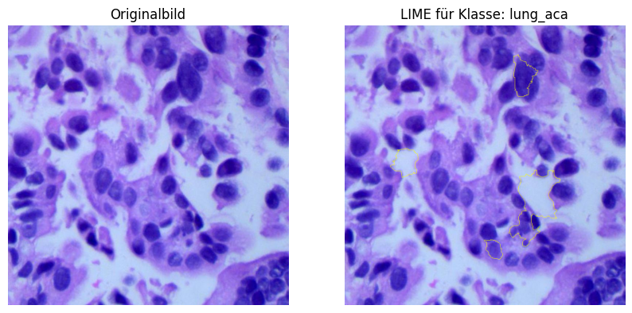
    


      0%|          | 0/1000 [00:00<?, ?it/s]


    
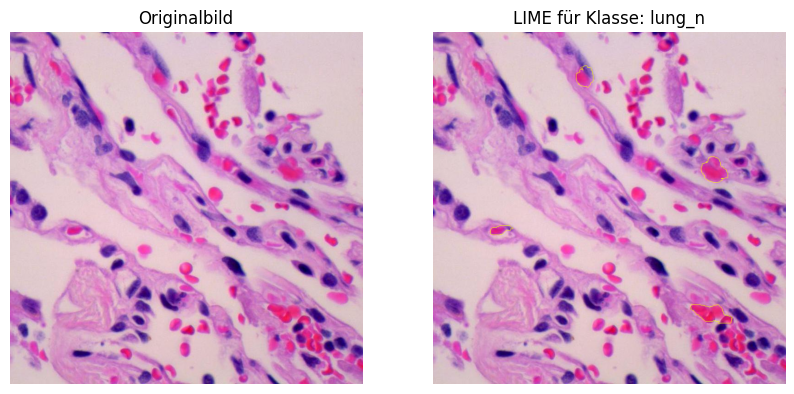
    


      0%|          | 0/1000 [00:00<?, ?it/s]


    
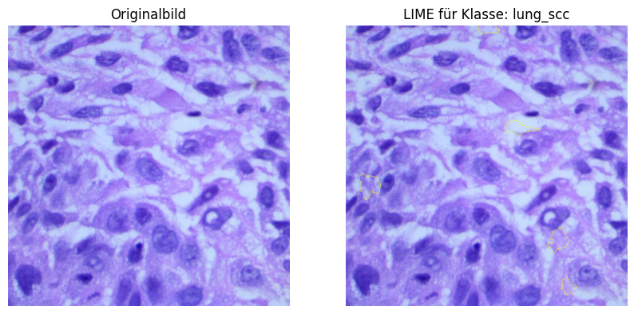
    


      0%|          | 0/1000 [00:00<?, ?it/s]


    
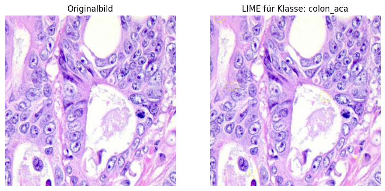
    


      0%|          | 0/1000 [00:00<?, ?it/s]


    
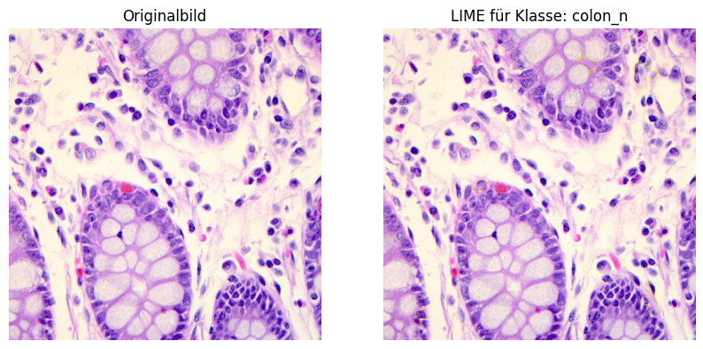
    


### Occlusion Sensitivity Analysis


```python
def occlusion_sensitivity_analysis(model, image_path, all_classes, mask_size=20, stride=10, device='cpu'):
    """
    Performs an Occlusion Sensitivity Analysis (OSA) on an image.

    Args:
        model: The trained CNN model.
        image_path: Path to the image to be tested.
        all_classes: List of class names.
        mask_size: Size of the occluded area (e.g., 20x20 pixels).
        stride: Step size for moving the mask.
        device: 'cpu' or 'cuda'.

    Returns:
        Displays a heatmap of sensitivity to occlusion.
    """

    print(f"Current image: {image_path}")

    # Transformation as during training
    transform = transforms.Compose([
        transforms.Resize((256, 256)),
        transforms.ToTensor(),
        transforms.Normalize(mean=[0.485, 0.456, 0.406], std=[0.229, 0.224, 0.225])
    ])
    
    # Load and transform the image
    image = Image.open(image_path).convert("RGB")
    image_tensor = transform(image).unsqueeze(0).to(device)

    # Ensure the model is in evaluation mode
    model.eval()

    # Compute prediction on the original image
    with torch.no_grad():
        original_output = model(image_tensor)
        original_prob = torch.nn.functional.softmax(original_output, dim=1)
        predicted_class = torch.argmax(original_prob, dim=1).item()

    print(f"Original prediction: {all_classes[predicted_class]} with probability {original_prob[0][predicted_class]:.4f}")

    # Prepare occlusion matrix
    width, height = 256, 256  # Input image size after resize
    heatmap = np.zeros((height // stride, width // stride))

    # Iterate over the image and mask regions step by step
    for y in range(0, height - mask_size, stride):
        for x in range(0, width - mask_size, stride):
            # Copy of the image with occluded region
            occluded_image = image_tensor.clone()
            occluded_image[:, :, y:y+mask_size, x:x+mask_size] = 0  # Set pixels in region to 0 (black)

            # Model prediction on the modified image
            with torch.no_grad():
                output = model(occluded_image)
                prob = torch.nn.functional.softmax(output, dim=1)[0, predicted_class].item()

            # Store the sensitivity value
            heatmap[y // stride, x // stride] = original_prob[0][predicted_class].item() - prob  # Calculate difference
    
    plt.figure(figsize=(6, 6))
    plt.imshow(image)
    plt.title("Original Image")
    plt.axis("off")
    plt.show()
    
    # Plot the sensitivity heatmap
    plt.figure(figsize=(8, 6))
    plt.imshow(heatmap, cmap='jet', interpolation='bilinear')
    plt.colorbar(label="Relevance loss due to occlusion")
    plt.title(f"Occlusion Sensitivity Analysis for {all_classes[predicted_class]}")
    plt.axis("off")
    plt.show()

def occlusion_sensitivity_multiple_images(model, image_paths, all_classes, mask_size=20, stride=10, device='cpu'):
    """
    Performs Occlusion Sensitivity Analysis for multiple images.

    Args:
        model: The trained CNN model.
        image_paths: List of image paths.
        all_classes: List of class names.
        mask_size: Size of the occluded area.
        stride: Step size for moving the mask.
        device: 'cpu' or 'cuda'.

    Returns:
        Displays an OSA heatmap for each image.
    """
    for image_path in image_paths:
        occlusion_sensitivity_analysis(model, image_path, all_classes, mask_size, stride, device)

image_paths = [
    '../lung_colon_image_set/lung_image_sets/lung_aca/lungaca27.jpeg',
    '../lung_colon_image_set/lung_image_sets/lung_n/lungn378.jpeg',
    '../lung_colon_image_set/lung_image_sets/lung_scc/lungscc234.jpeg',
    '../lung_colon_image_set/colon_image_sets/colon_aca/colonca3874.jpeg',
    '../lung_colon_image_set/colon_image_sets/colon_n/colonn198.jpeg'
]

occlusion_sensitivity_multiple_images(model, image_paths, all_classes, mask_size=20, stride=10, device=device)

```

    Current image: ../lung_colon_image_set/lung_image_sets/lung_aca/lungaca27.jpeg
    Original prediction: lung_aca with probability 0.9932


    

    


    
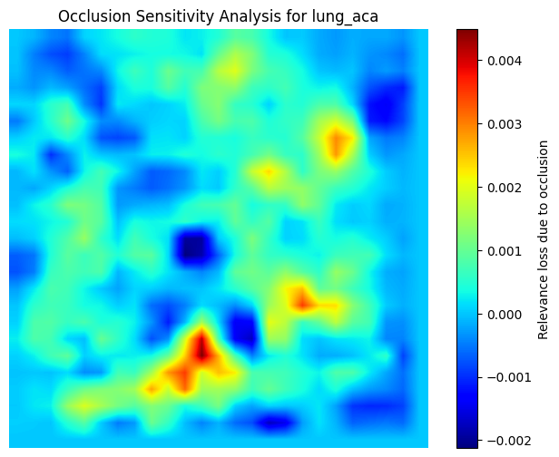
    


    Current image: ../lung_colon_image_set/lung_image_sets/lung_n/lungn378.jpeg
    Original prediction: lung_n with probability 0.9999


    
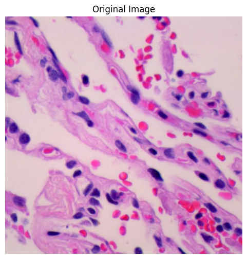
    


    
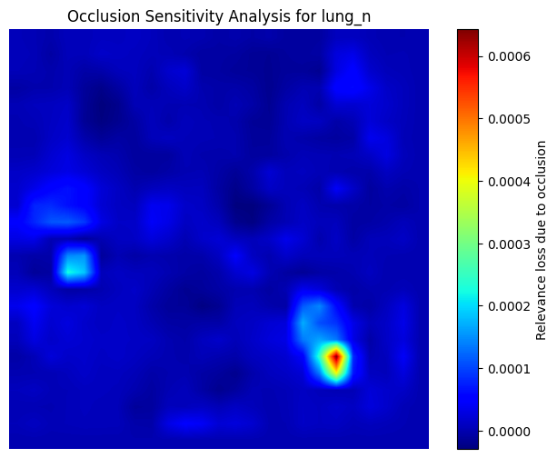
    


    Current image: ../lung_colon_image_set/lung_image_sets/lung_scc/lungscc234.jpeg
    Original prediction: lung_scc with probability 0.4999


    
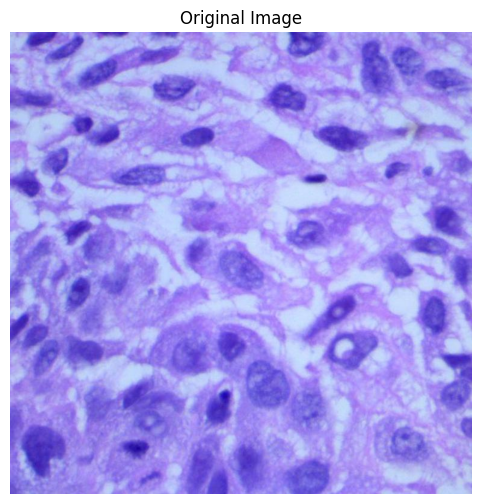
    


    
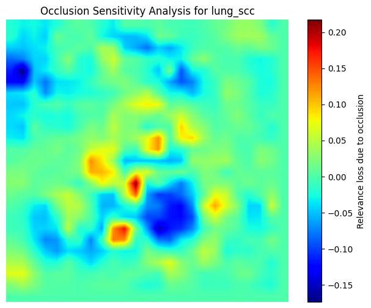
    


    Current image: ../lung_colon_image_set/colon_image_sets/colon_aca/colonca3874.jpeg
    Original prediction: colon_aca with probability 0.9996


    
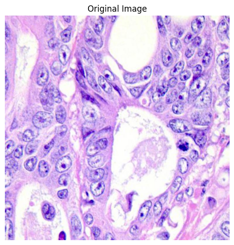
    


    
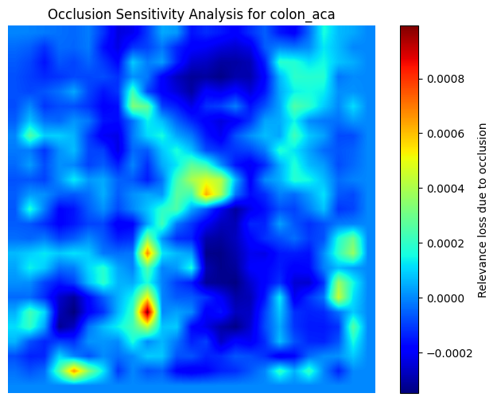
    


    Current image: ../lung_colon_image_set/colon_image_sets/colon_n/colonn198.jpeg
    Original prediction: colon_n with probability 0.9453


    

    


    
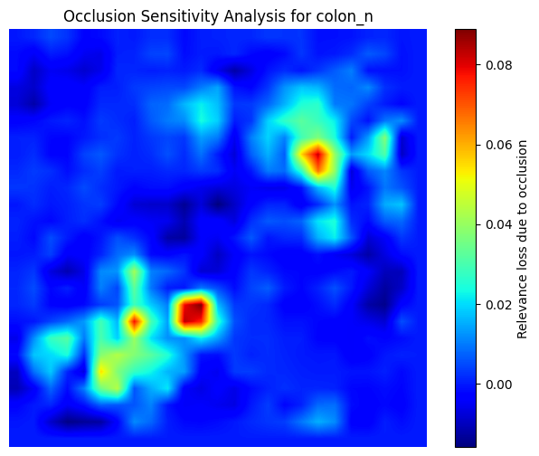
    


```python
from captum.attr import Occlusion

def occlusion_sensitivity_captum(model, image_path, all_classes, mask_size=20, stride=10, device='cpu'):
    """
    Performs Occlusion Sensitivity Analysis (OSA) using Captum.

    Args:
        model: The trained CNN model.
        image_path: Path to the image to be tested.
        all_classes: List of class names.
        mask_size: Size of the occluded area (e.g., 20x20 pixels).
        stride: Step size for moving the mask.
        device: 'cpu' or 'cuda'.

    Returns:
        Displays a heatmap of sensitivity to occlusion.
    """

    print(f"Processing image: {image_path}")

    # Image transformation as used in training
    transform = transforms.Compose([
        transforms.Resize((256, 256)),
        transforms.RandomRotation(random.randint(0,20)),
        transforms.ToTensor(),
        transforms.Normalize(mean=[0.485, 0.456, 0.406], std=[0.229, 0.224, 0.225])
    ])
    
    # Load and transform the image
    image = Image.open(image_path).convert("RGB")
    input_tensor = transform(image).unsqueeze(0).to(device)

    # Ensure model is in evaluation mode
    model.eval()

    # Forward pass to get the prediction
    with torch.no_grad():
        original_output = model(input_tensor)
        original_prob = torch.nn.functional.softmax(original_output, dim=1)
        predicted_class = torch.argmax(original_prob, dim=1).item()

    print(f"Predicted class: {all_classes[predicted_class]} (probability: {original_prob[0][predicted_class]:.4f})")

    # Define Occlusion Sensitivity using Captum
    occlusion = Occlusion(model)

    # Compute occlusion sensitivity
    attributions = occlusion.attribute(
        input_tensor,  # Input image tensor
        strides=(3, stride, stride),  # How much to shift the mask
        sliding_window_shapes=(3, mask_size, mask_size),  # Shape of occlusion patch
        target=predicted_class  # Class for which we compute occlusion sensitivity
    )

    # Convert attributions to numpy for visualization
    attributions = attributions.squeeze().cpu().detach().numpy()  # Shape: (3, H, W)

    # Convert 3-channel attribution to a single-channel grayscale map
    attributions = np.mean(attributions, axis=0)  # Take mean across RGB channels

    # Normalize attributions to [0, 1] range
    attributions = np.maximum(attributions, 0)  # Remove negative values
    attributions = attributions / (attributions.max() + 1e-8)  # Avoid division by zero

    # Display original image
    plt.figure(figsize=(6, 6))
    plt.imshow(image)
    plt.title("Original Image")
    plt.axis("off")
    plt.show()
    
    # Plot the occlusion sensitivity heatmap
    plt.figure(figsize=(8, 6))
    plt.imshow(attributions, cmap='jet', interpolation='bilinear')
    plt.colorbar(label="Relevance loss due to occlusion")
    plt.title(f"Occlusion Sensitivity Analysis for {all_classes[predicted_class]}")
    plt.axis("off")
    plt.show()

def occlusion_sensitivity_multiple_images_captum(model, image_paths, all_classes, mask_size=20, stride=10, device='cpu'):
    """
    Performs Occlusion Sensitivity Analysis for multiple images using Captum.

    Args:
        model: The trained CNN model.
        image_paths: List of image paths.
        all_classes: List of class names.
        mask_size: Size of the occluded area.
        stride: Step size for moving the mask.
        device: 'cpu' or 'cuda'.

    Returns:
        Displays an OSA heatmap for each image.
    """
    for image_path in image_paths:
        occlusion_sensitivity_captum(model, image_path, all_classes, mask_size, stride, device)

image_paths = [
    '../lung_colon_image_set/lung_image_sets/lung_aca/lungaca27.jpeg',
    '../lung_colon_image_set/lung_image_sets/lung_n/lungn378.jpeg',
    '../lung_colon_image_set/lung_image_sets/lung_scc/lungscc234.jpeg',
    '../lung_colon_image_set/colon_image_sets/colon_aca/colonca3874.jpeg',
    '../lung_colon_image_set/colon_image_sets/colon_n/colonn198.jpeg'
]

occlusion_sensitivity_multiple_images_captum(model, image_paths, all_classes, mask_size=20, stride=10, device=device)

```

    Processing image: ../lung_colon_image_set/lung_image_sets/lung_aca/lungaca27.jpeg
    Predicted class: lung_aca (probability: 0.9858)


    
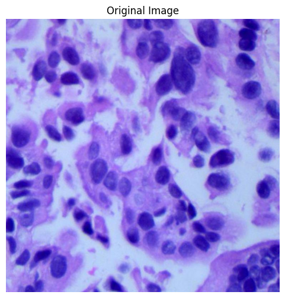
    


    
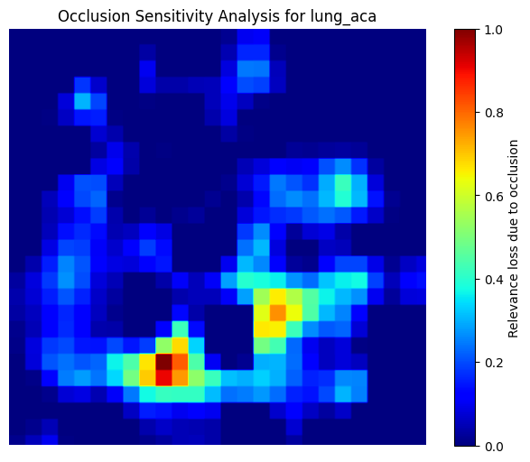
    


    Processing image: ../lung_colon_image_set/lung_image_sets/lung_n/lungn378.jpeg
    Predicted class: lung_n (probability: 1.0000)


    

    


    
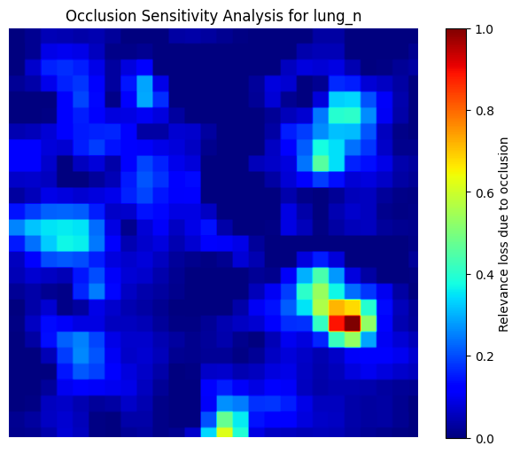
    


    Processing image: ../lung_colon_image_set/lung_image_sets/lung_scc/lungscc234.jpeg
    Predicted class: lung_scc (probability: 0.4999)


    

    


    
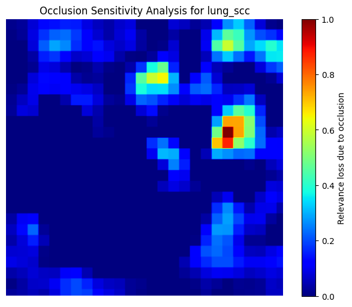
    


    Processing image: ../lung_colon_image_set/colon_image_sets/colon_aca/colonca3874.jpeg
    Predicted class: colon_aca (probability: 0.9893)


    

    


    
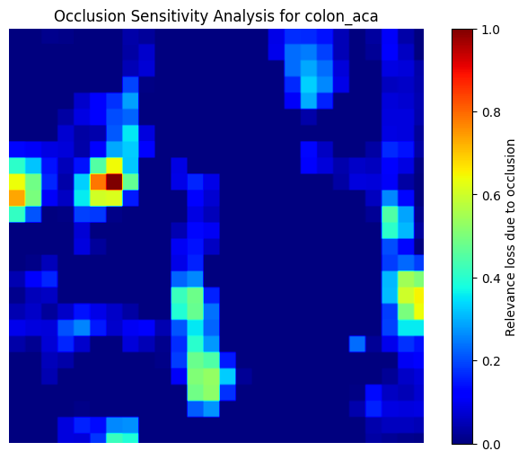
    


    Processing image: ../lung_colon_image_set/colon_image_sets/colon_n/colonn198.jpeg
    Predicted class: colon_n (probability: 0.9498)


    
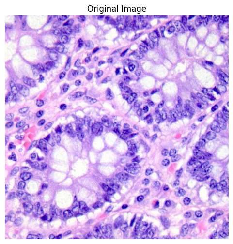
    


    
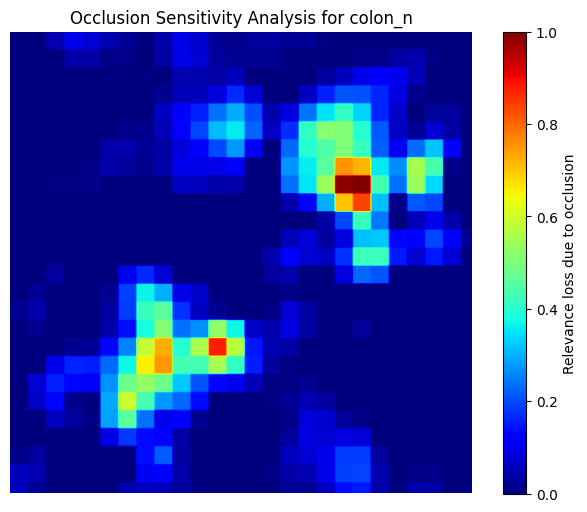
    


```python
from captum.attr import GuidedBackprop

def preprocess_image(image_path, device):
    """Loads and preprocesses an image."""
    image = Image.open(image_path).convert("RGB")
    input_tensor = transform(image).unsqueeze(0).to(device, dtype=torch.float32)  # Force float32
    return input_tensor, image

def guided_backprop(model, image_path, all_classes, device='cpu'):
    """
    Uses Guided Backpropagation to visualize important pixels.

    Args:
        model: The trained CNN model.
        image_path: Path to the image.
        all_classes: List of class names.
        device: 'cpu', 'cuda', or 'mps' (for Apple Silicon).

    Returns:
        Displays Guided Backprop heatmap.
    """

    input_tensor, image = preprocess_image(image_path, device)
    model.to(device).eval()

    output = model(input_tensor)
    pred_label = output.argmax(dim=1).item()
    print(f"Predicted class: {all_classes[pred_label]}")


    gbp = GuidedBackprop(model)
    attributions = gbp.attribute(input_tensor, target=pred_label)

    attributions = attributions.squeeze().cpu().detach().numpy().astype(np.float32) 
    attributions = np.mean(attributions, axis=0)
    attributions = np.maximum(attributions, 0)  
    attributions /= (attributions.max() + 1e-8)  

    plt.figure(figsize=(10, 5))
    plt.subplot(1, 2, 1)
    plt.imshow(image)
    plt.title("Original Image")
    plt.axis("off")

    plt.subplot(1, 2, 2)
    plt.imshow(attributions, cmap='viridis', interpolation='bilinear')
    plt.colorbar()
    plt.title("Guided Backpropagation Heatmap")
    plt.axis("off")
    plt.show()


for image_path in image_paths:
    guided_backprop(model, image_path, all_classes, device='mps')  

```

    Predicted class: lung_aca


    /Library/Frameworks/Python.framework/Versions/3.12/lib/python3.12/site-packages/captum/attr/_core/guided_backprop_deconvnet.py:64: UserWarning: Setting backward hooks on ReLU activations.The hooks will be removed after the attribution is finished
      warnings.warn(


    
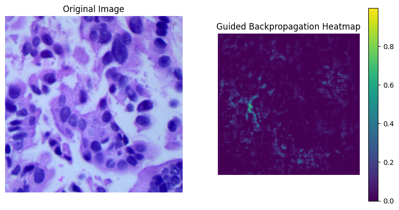
    


    Predicted class: lung_n


    
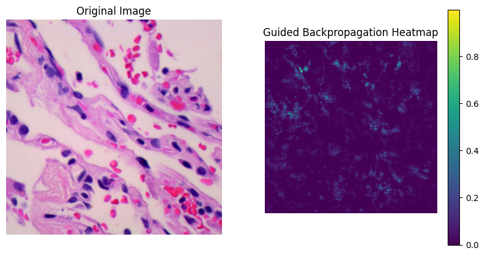
    


    Predicted class: lung_scc


    
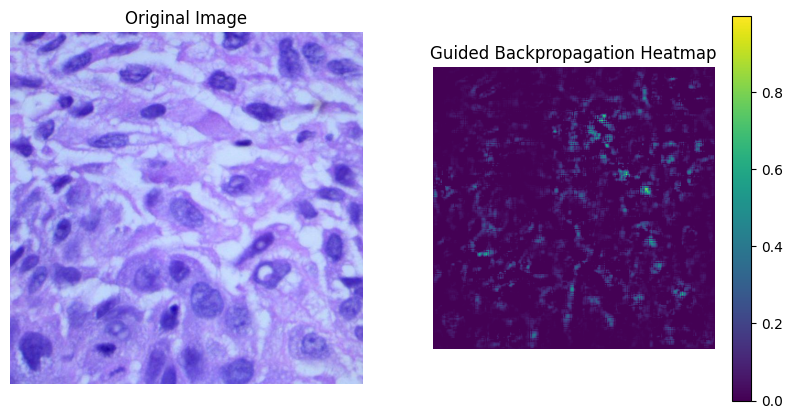
    


    Predicted class: colon_aca


    
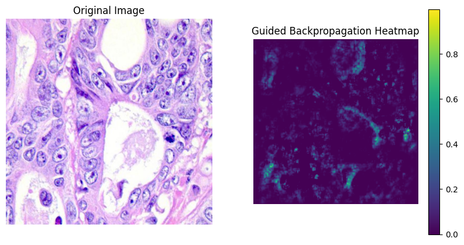
    


    Predicted class: colon_n


    
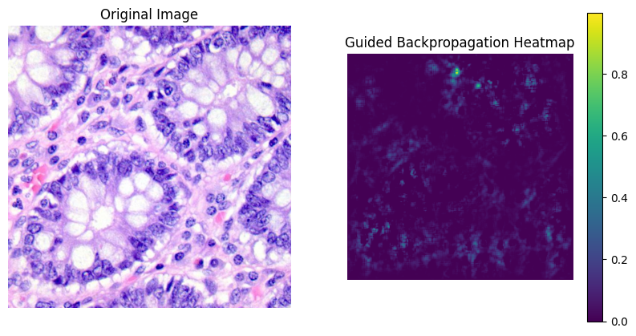
    

